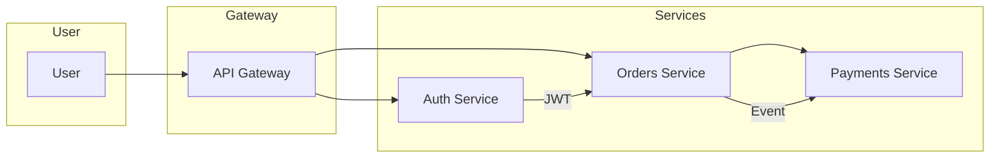

# Hi — I'm **codesysteam** 👋

<p align="center">
  
</p>

<p align="center">
  <!-- Core badges: repo, stars, releases, license, issues, actions -->
  
  
  
  
  
</p>

---

## 🔭 Table of Contents

1. [What I do](#what-i-do)
2. [Highlights & Live Demos](#highlights--live-demos)
3. [Tech Stack & Badges](#tech-stack--badges)
4. [Dynamic GitHub Overview](#dynamic-github-overview)
5. [Featured Projects](#featured-projects)
6. [Architecture & Diagrams](#architecture--diagrams)
7. [Install / Quick Start](#install--quick-start)
8. [CI / Releases / Packages](#ci--releases--packages)
9. [Roadmap & Changelog](#roadmap--changelog)
10. [Contributing & Support](#contributing--support)
11. [Extras — Widgets, Snippets & Tricks](#extras--widgets-snippets--tricks)

---

## ✨ What I do

I build **scalable backend systems**, developer tools, and infra automation focused on reliability and observability. I love crafting developer experiences that reduce cognitive load and ship faster.

* 🔧 Production systems, observability, and infra as code
* ⚙️ Developer tooling, templates, and DX improvements
* 📦 Packaging and deployment automation
* 🤝 Open to collaboration on tooling and infra projects

---

## 🚀 Highlights & Live Demos

> Click the cards for quick access to demos, CI, packages and docs.

<p align="center">
  <a href="https://github.com/codesysteam/awesome-project"></a>
  <a href="https://github.com/codesysteam/infra-tools"></a>
  <a href="https://github.com/codesysteam/ui-kit"></a>
</p>

<p align="center">
  <!-- Animated demo GIF placeholder -->
  
</p>

---

## 🛠️ Tech Stack & Badges

<p>
  
  
  
  
  
  
</p>

---

## 📊 Dynamic GitHub Overview

<p align="center">
  
</p>

<p align="center">
  
</p>

---

## 🔎 Featured Projects

### 🔭 **awesome-project** — High-performance microservice template

* **Repo:** `github.com/codesysteam/awesome-project`
* **Demo:** `https://codesysteam.github.io/awesome-project` (placeholder)
* **Highlights:** pre-wired metrics & tracing, CI templates, multi-env deployment
* **Quick links:** [Docs](https://github.com/codesysteam/awesome-project#readme) • [CI](https://github.com/codesysteam/awesome-project/actions) • [Releases](https://github.com/codesysteam/awesome-project/releases)

### ⚙️ **infra-tools** — Infrastructure helpers & Terraform modules

* **Repo:** `github.com/codesysteam/infra-tools`
* **Highlights:** opinionated Terraform modules, helm charts, operators
* **Quick links:** [Examples](https://github.com/codesysteam/infra-tools/examples) • [Docs](https://github.com/codesysteam/infra-tools#readme)

### 📦 **ui-kit** — Component library and design tokens

* **Repo:** `github.com/codesysteam/ui-kit`
* **Highlights:** accessible components, Storybook demos, themeable tokens
* **Quick links:** [Storybook](https://github.com/codesysteam/ui-kit#storybook) • [NPM](https://www.npmjs.com/package/ui-kit-placeholder)

---

## 🏗️ Architecture & Diagrams

<details>
<summary>System overview (click to expand)</summary>



Architecture notes:

* API Gateway handles routing, auth, rate-limiting
* Services communicate via gRPC/events
* Observability: Prometheus + Grafana + Jaeger

</details>

---

## ⚡ Install / Quick Start

```bash
# clone a template
git clone https://github.com/codesysteam/awesome-project.git
cd awesome-project

# start locally (example with docker-compose)
docker-compose up --build

# run tests
make test
```

---

## 📦 CI / Releases / Packages

* CI: GitHub Actions (status badge above)
* Releases: GitHub Releases with semantic versioning
* Packages: Docker images (DockerHub/GHCR) + optional NPM packages for UI

Badges you can add:

```
[]
[]
[]
```

---

## 🛣️ Roadmap & Changelog

* Roadmap: `docs/ROADMAP.md` (link to your repo file)
* Changelog: `CHANGELOG.md` (link to your repo file)

> Use GitHub Projects / Issues for release planning and milestone tracking.

---

## 🤝 Contributing & Support

I welcome contributors. Key touchpoints:

* ✅ **Read** `CONTRIBUTING.md` before opening PRs
* 🐛 Report bugs using **Issues**: label them `bug`, `enhancement`, `question`
* 🧪 Write tests and update docs for non-trivial changes
* 🔒 Security reports go to `SECURITY.md` in the repo

**Support options**

* Sponsor / back the project: `https://github.com/sponsors/codesysteam` (if you enable GitHub Sponsors)
* Create a discussion in the repo for feature requests and roadmap talks

---

## ✨ Extras — Widgets, Snippets & Tricks

### Visitor counter

```

```

### Dynamic status / badge examples

```


```

### Collapsible sections for long READMEs

<details>
<summary>Click to expand more tips</summary>

* Embed GIFs from `assets/` with ``
* Add `README.assets/` for images referenced by project cards
* Use `readme-typing-svg` for dynamic headlines (already present)

</details>

---

## 📌 Quick Snippets (copy & paste)

**Project card with GIF**

```md
[](https://github.com/codesysteam/awesome-project)


**awesome-project** — High-performance microservice template. `Go • gRPC • K8s`
```

---

## 🧾 License

This README template: **MIT** — adapt and reuse freely.

---

*Last updated: **2025-10-19***

---

> Notes:
>
> * I removed all external social-media links (Twitter/LinkedIn/etc.) as requested.
> * I added many interactive elements, badges, demo placeholders, architecture diagram, and quick-copy snippets.
> * Replace placeholder demo URLs, GIFs, and package names with your actual assets to enable all widgets.
